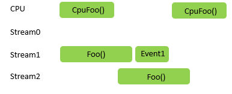
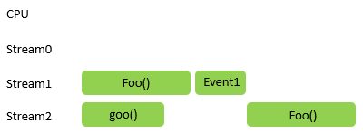

# Question 1 
Explain why NVIDIA GPUs do not provide any support for grid-level synchronization.

## Response
NVIDIA GPUs does not provide any support fro grid-level synchronization because it would require the introduction of complex HW mechanism across different SM in the architecture. Therefore in order to keep the architecture simplier and more performing NVIDIA does not provide the support for this type of synchronization

# Question 2 
Draw the Gantt chart of the execution of the various functions in the following three cases.

```
(a) Assume that foo execution is longer than cpuFoo one. 
cudaStreamCreate(&stream1);  
cudaStreamCreate(&stream2);  
foo<<<blocks, threads, 0, stream1>>>();  
cudaEventRecord(event1, stream1); 
cpuFoo(); 
foo<<<blocks, threads, 0, stream2>>>();  
cudaEventSynchronize(event1); 
cpuFoo(); 
```
 ```
(b) Assume that foo execution is longer than goo one. 
cudaStreamCreate(&stream1);  
cudaStreamCreate(&stream2);  
foo<<<blocks, threads, 0, stream1>>>();  
cudaEventRecord(event1, stream1); 
goo<<<blocks, threads, 0, stream2>>>();  
cudaStreamWaitEvent(stream2, event1); 
foo<<<blocks, threads, 0, stream2>>>();  
 ```
 ```
(c) 
cudaStreamCreate(&stream1);  
cudaStreamCreate(&stream2);  
foo<<<blocks, threads, 0, stream1>>>();  
foo<<<blocks, threads>>>();  
foo<<<blocks, threads, 0, stream2>>>(); 
```

## Response




# Question 3 
Explain why OpenCL mainly adopts the just-in-time (JIT) compilation for the kernels to execute and which is the 
main exception where the JIT approach cannot be used.

## Response
OpenCL mainly adopts the JIT compilation in order to achieve an higher flexibility. In fact with the JIT compilation a program can be compiled while the underlying HW architecture is being discovered at runtime allowing in this way to make our program targeted to different HW accelerators. This technique cannot be used if the used device is an FPGA, since this type of HW accelerators does not have a fixed architecture, and discover it is not an "immediate" process since it requires the synthesis of the HW accelerator.

# Question 4 
Describe  the  data  structures  used  in  a  CUDA  implementation  of  the  graph  search  application  and  how 
computation is parallelized on them.

## Response
A CUDA implementation of graph search application include as data structure used:
1. One data structure to store the currentFrontier found by the threads of a single block (Shared memory)
2. One integer defining the size of the current frontier (Shared memory)
3. One integer defining the index of the global frontier, which will be the final result (Shared memory)

Computation is simply parallelized on them by letting the threads of a single block handle all the arcs outgoing from a certain node of the graph and atomically add them if they haven't been already visited by other threads on the currentFrontier data structure (if already full, the vertex are added directly to the global frontier stored in the global memory) and finally the first thread of each block commits the block's partial result into the global memory.

# Question 5 
Explain why for an NVIDIA GPU data organization in a structure of arrays may be more efficient for memory 
accesses than in an array of structures. 
 
Structure of arrays: 
 
 ```
typedef struct {  
  float x[N];  
  float y[N];  
} innerArray_t; 
innerArray_t mySoA; 
Array of structures: 
 ```
 ```
typedef struct {  
  float x;  
  float y;  
} innerStruct_t; 
innerStruct_t myAoS[N]; 
```

## Response
For NVIDIA GPU data organization, structure of arrays may be more efficient than array of structs, because with structs of arrays the different arrays are store in memory in a linearized way, meaning that contiguous threads can access the element of each array in contiguous memory address resulting in an coalesced aligned memory access.
On the contrary if we use arrays of structs the data will be linearized in memory according to the struct content, meaning that for instance for the exemple above we would have in memory x[0] y[0] x[1] y[1], but then threads with contiguous IDS will access NON contiguous memory addresses resulting in NOT coalesced aligned memory accesses.